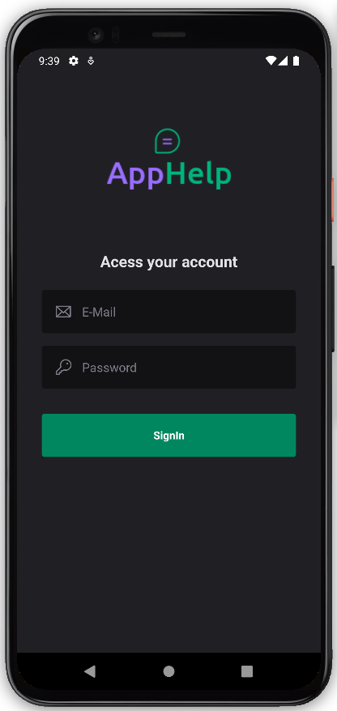
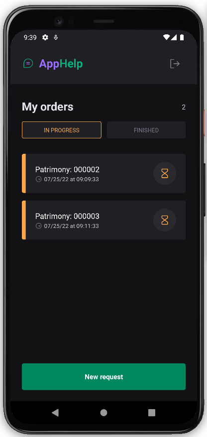
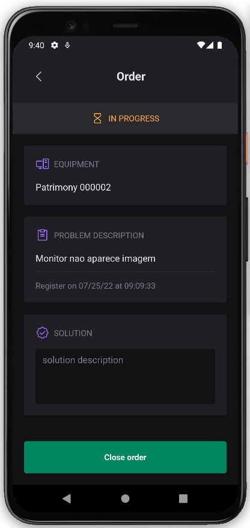
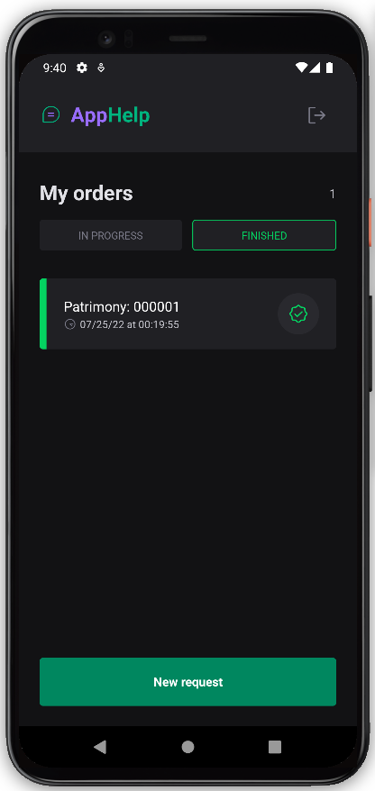
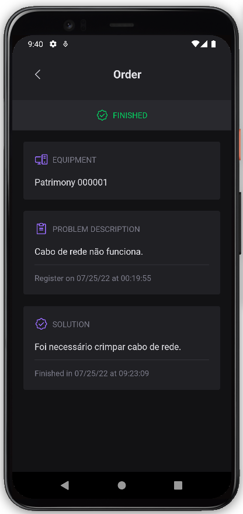

<div align="center" style="margin-bottom: 20px;">
  
  <br/><br/>
  
  <p align="center">
    
    
    
    
  </p>  
</div>

### About project
This is a project developed in the rocketseat school's ignite lab week, it's a mobile application for android and iOS on technical support demands, it was developed with react-native technology.


### Main technologies
- [Expo](https://docs.expo.dev/)
- [TypeScript](https://www.typescriptlang.org/docs/)
- [React Native](https://reactnative.dev/)
- [Native Base](https://nativebase.io/)
- [Firebase](https://firebase.google.com/)

### Run this project
You need to have the base configuration on your machine to run a React Native project natively, follow the instructions for Android or iOS.

Tutorial: https://react-native.rocketseat.dev/

> NOTE: Due to firebase incompatibility, running this project with expo will not work correctly.

```bash
# clone this project
$ git clone https://github.com/jefferson1104/appHelp-reactNative.git

# access the project folder
$ cd appHelp-reactNative

# install dependencies
$ npm install

# run the project Android
$ npm run android

# default user and password to login
EMAIL: john.doe@mail.com
PASSWORD: 12345
```

### Screenshots
<p align="center">
  
  
  
  
  
</p>
